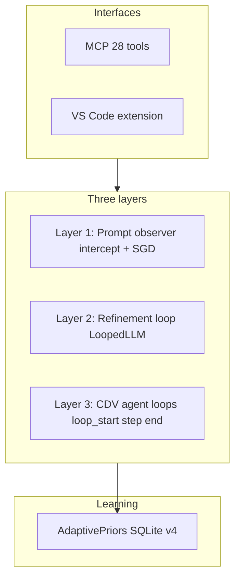
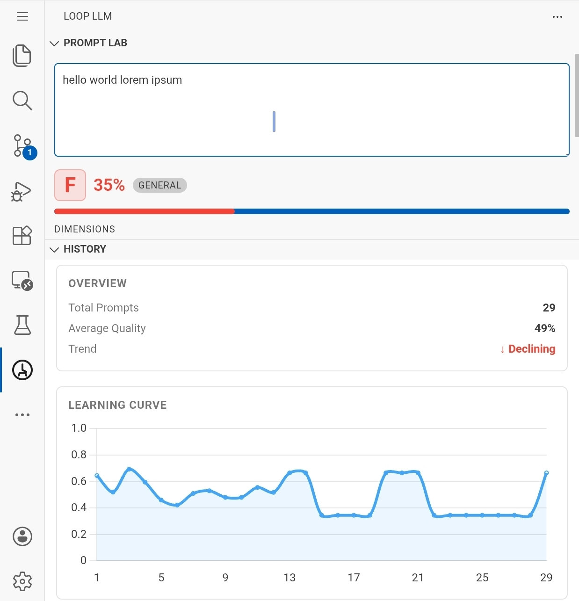
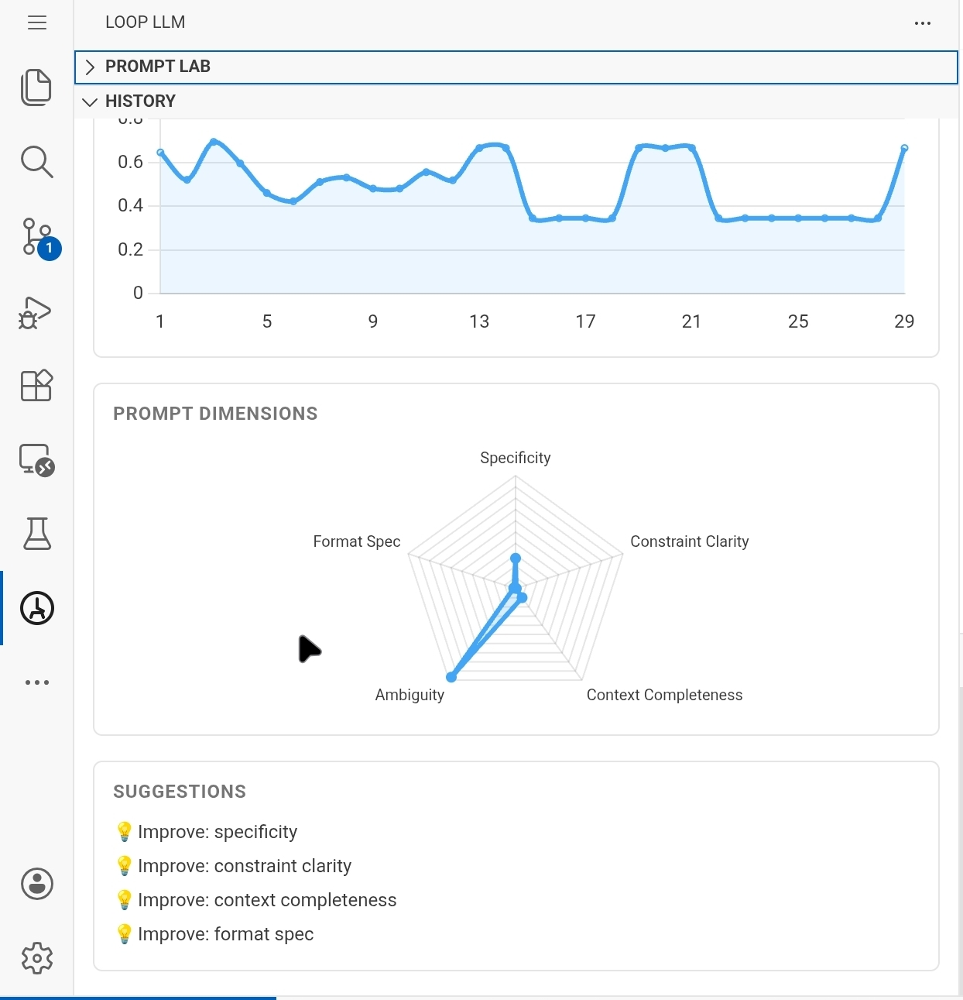
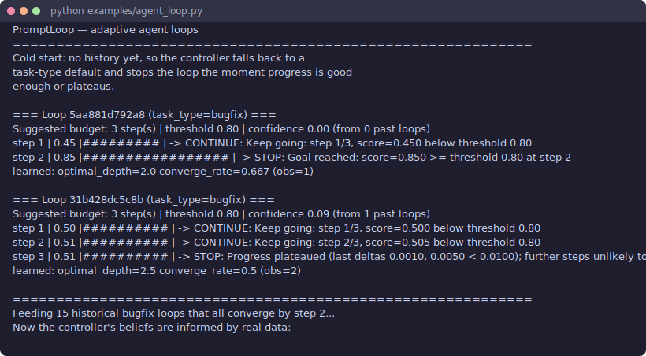

# PromptLoop

[](https://github.com/azank1/loop-llm)

[](https://github.com/azank1/loop-llm/actions/workflows/ci.yml)
[](https://opensource.org/licenses/MIT)
[](https://pypi.org/project/loopllm/)
[](https://github.com/azank1/loop-llm/tree/main/vscode-loopllm)

**A Bayesian MCP sidecar for your IDE agent** — observe prompts, refine outputs, and
stop agent loops using externally verified scores.

> The underlying CLI and tool API ship as `loopllm` (the original name). PromptLoop is the project brand. Current release: **v0.7.0**.

---

## What is PromptLoop?

PromptLoop sits between you and Cursor, VS Code Copilot, or any MCP client. It does
not replace your agent harness — it adds three capabilities on top:

1. **Prompt observer** — score every prompt across 5 dimensions, route to elicitation
   or refinement, learn your preferences via online SGD.
2. **Refinement loop** — generate → evaluate → retry inside a single MCP tool call
   using sampling (`loopllm_run_pipeline`, `loopllm_refine`).
3. **Conservative Dual-Verify agent loops** — agents submit step **artifacts**; the
   server scores them through two independent channels and learns when to stop
   (`loopllm_loop_start` / `loop_step` / `loop_end`).

All three layers share one Bayesian learning core (`AdaptivePriors` + SQLite) — no
training data, no PyTorch.

---

## System at a glance



| Layer | Entry point | What it does |
|---|---|---|
| 1 — Observer | `loopllm_intercept` | Score, route, log; Thompson Sampling for questions |
| 2 — Refinement | `loopllm_run_pipeline` | Elicit → decompose → execute → verify via MCP sampling |
| 3 — CDV loops | `loopllm_loop_step(step_output=...)` | External dual-verify scoring → guards → Bayesian stop |

---

## Quickstart

```bash
git clone https://github.com/azank1/loop-llm   # GitHub repo still named loop-llm
cd loop-llm
pip install -e ".[mcp]"
code .    # or open in Cursor
```

`.vscode/mcp.json` and `.cursor/mcp.json` are committed — the MCP server is picked
up automatically. Verify on first load:

```
use loopllm_intercept with prompt: add retry logic to the download function
```

For iterative tasks, start a CDV loop:

```
use loopllm_loop_start with goal="make the failing test pass" task_type="bugfix"
```

---

## VS Code Extension

Install the companion extension for a live quality scratchpad and prompt history
dashboard directly in the sidebar.

<table>
<tr>
<td width="50%" valign="top">

**Prompt Lab** — live quality scratchpad



Scores on every keystroke (350 ms debounce). Grade badge, 5 dimension bars, issues + suggestions tags, Copy and Send to Chat.

</td>
<td width="50%" valign="top">

**History** — learning curve + metrics



Learning curve sparkline, grade distribution, SGD learned weights per dimension. Updates after every `loopllm_feedback` call.

</td>
</tr>
</table>

Build and install the extension from source:

```bash
cd vscode-loopllm
npm install
npx @vscode/vsce package          # produces loopllm-prompt-gauge-0.1.0.vsix
code --install-extension loopllm-prompt-gauge-0.1.0.vsix
```

---

## Conservative Dual-Verify (CDV) — Layer 3

Most agent loops stop on a fixed `max_iterations` or let the agent self-grade when
it's "done." Both waste tokens or optimize **reported** progress. v0.7 introduces
**Conservative Dual-Verify**: agents submit **step artifacts** (test logs, diffs,
summaries); the MCP server scores them through **two independent channels** and
feeds the **stricter** score into Bayesian stop/continue logic.

```python
channel_a = deterministic_evaluator.evaluate(step_output)   # regex, JSON, completeness
channel_b = critic_sample(step_output, goal, criteria)      # separate verifier call
final_score = min(channel_a, channel_b)                   # either channel can veto
```

```
loopllm_loop_start(
  goal="refactor module and make tests pass",
  task_type="bugfix",
  required_patterns=["tests passed"],
)
  → { suggested_budget: 3, quality_threshold: 0.8, evaluator_type: "composite" }

loopllm_loop_step(session_id, step_output="pytest: 3 failed, 12 passed")
  → {
      decision: "continue",
      score: 0.0,
      channel_a_score: 0.0,
      channel_b_score: 0.55,
      score_source: "conservative_dual_verify",
      deficiencies: ["Required pattern not found: tests passed"],
    }

loopllm_loop_end(session_id)   → learns optimal depth from verified trajectories
```

`loopllm_loop_step` returns `stop` when any guard fires: goal reached (verified score),
plateau, low Bayesian ROI, budget exhausted, timeout, token cap, or repeated output.

See [`examples/agent_loop.py`](examples/agent_loop.py) for the library demo and
[`docs/demo/agent_loop_demo.md`](docs/demo/agent_loop_demo.md) for CDV via MCP.

```python
from loopllm import AdaptivePriors, AgentLoopController

controller = AgentLoopController(AdaptivePriors())
session = controller.start("fix flaky test", task_type="bugfix")
verdict = controller.step(session.session_id, score=0.9)   # library API (pre-scored)
controller.end(session.session_id)
```



What a terminal run looks like (`python examples/agent_loop.py`):

```text
=== Loop (task_type=bugfix) ===
Suggested budget: 3 step(s) | threshold 0.80 | confidence 0.00 (from 0 past loops)
  step  1 | 0.45 |#########           | -> CONTINUE: step 1/3, score 0.450 below 0.80
  step  2 | 0.85 |#################   | -> STOP: Goal reached: 0.850 >= 0.80 at step 2
```

### Benchmark: adaptive vs fixed `max_iterations`

Reproducible simulation (`benchmarks/adaptive_vs_fixed.py`, seed=7, 300 test tasks,
threshold 0.80):

| Strategy | Mean steps | Mean final score | % reaching 0.80 | Wasted steps | Efficiency (reach/step) |
|---|---|---|---|---|---|
| fixed (budget=2) | 2.00 | 0.698 | 34.3% | 0.00 | 17.2 |
| fixed (budget=6) | 6.00 | 0.939 | 94.0% | 2.50 | 15.7 |
| threshold (reactive) | 3.56 | 0.852 | 100.0% | 0.00 | 28.1 |
| **adaptive (loopllm)** | **3.56** | **0.852** | **99.7%** | **0.00** | **28.0** |

**Adaptive uses ~41% fewer steps than a fixed 6-step budget** while reaching the bar
on 99.7% of tasks. Repro: `python benchmarks/adaptive_vs_fixed.py`.

> Honest caveat: simulation with stated assumptions; measures *decision efficiency
> given a quality signal*, not absolute model quality.

---

## Prompt pipeline — Layer 2

`loopllm_run_pipeline` is the main entry point for observe → elicit → refine → verify:

```
loopllm_run_pipeline("add retry logic to the download function")
```

What happens inside:
1. **Score** the prompt across 5 dimensions (< 1 ms, deterministic)
2. **Elicit** clarifying questions if quality < 0.6 — Thompson Sampling on Beta priors
3. **Decompose** into subtasks if complexity > 0.5
4. **Execute** each subtask: `ctx.sample(prompt)` → evaluate → retry if below threshold
5. **Verify** the assembled output via a second `ctx.sample()` call
6. **Log** result to SQLite; update scoring weights via online SGD

Everything runs inline via MCP Sampling — no extra chat turns, no polling.

---

## How it works — Layer 1

```
You type a prompt
      ↓
loopllm_intercept          ← scores across 5 dimensions (~0ms, deterministic)
      ↓
route decision
  < 0.4  → elicitation     ← Thompson Sampling picks the highest-gain question
  0.4–0.6 → elicit + refine
  ≥ 0.6  → refine directly
      ↓
loopllm_refine (if needed)
  → ctx.sample(prompt)     ← MCP Sampling: calls host LLM mid-execution
  → evaluate output        ← deterministic evaluators (length, regex, JSON schema)
  → if score < threshold: ctx.sample(improved prompt)
      ↓
result logged to ~/.loopllm/store.db
      ↓
loopllm_feedback (optional rating 1–5) → SGD updates dimension weights
```

**Scoring dimensions** (each 0–1, composited by learned weights into grade A–F):

| Dimension | What it catches |
|---|---|
| Specificity | Vague, generic requests |
| Constraint Clarity | Missing format, length, or rule requirements |
| Context Completeness | No background or goal stated |
| Ambiguity | Unclear references, pronouns without antecedents |
| Format Specification | No output format specified |

**MCP Sampling** — generation tools call `ctx.sample()` to invoke the host agent's LLM
inline. Falls back to `agent_execute` passthrough if the client doesn't declare sampling.

<details>
<summary>Learning math (SGD, Thompson Sampling, Bayesian priors)</summary>

### Online Gradient Descent on scoring weights

Default weights: `{specificity: 0.25, constraint_clarity: 0.20, context_completeness: 0.20, ambiguity: 0.20, format_spec: 0.15}`. Each `loopllm_feedback(rating)` runs one SGD step; weights clip to $[0.05, 0.50]$ and renormalise. Persisted in `learned_weights` (schema v4).

### Thompson Sampling for question ordering

Each question type maintains $\text{Beta}(\alpha, \beta)$; the pipeline draws $s_i \sim \text{Beta}(\alpha_i, \beta_i)$ and picks $\arg\max_i s_i$.

### Beta-Binomial Bayesian priors

Per-(task\_type, model) convergence priors drive adaptive exit in `adaptive_exit.py` via `BetaPrior.prob_above(threshold)`.

### Welford online variance

`NormalPrior` tracks running mean/variance with optional exponential decay ($\lambda = 0.95$).

</details>

---

## Install as a package

```bash
pip install loopllm[mcp]
```

Add `.vscode/mcp.json` to your project:

```json
{
  "servers": {
    "loopllm": {
      "type": "stdio",
      "command": "loopllm",
      "args": ["mcp-server", "--provider", "agent"]
    }
  }
}
```

Cursor users: `.cursor/mcp.json` uses `"mcpServers"` as the top-level key.

---

## Tools (28)

| Tool | What it does |
|---|---|
| `loopllm_run_pipeline` | **Layer 2.** Elicit → decompose → execute → verify in one call |
| `loopllm_intercept` | **Layer 1.** Score + route a prompt; logs to history |
| `loopllm_gauge` | Instant quality bars, no DB write |
| `loopllm_refine` | Score → sample → retry loop via MCP Sampling |
| `loopllm_plan_tasks` | Decompose a goal into ordered subtasks via MCP Sampling |
| `loopllm_verify_output` | Keyword pre-check + deep sample against quality criteria |
| `loopllm_elicitation_start/answer/finish` | Multi-turn clarifying question session |
| `loopllm_plan_register` | Create a confidence-gated plan saved to SQLite |
| `loopllm_plan_next` | Advance to next task; returns `needs_replan` if quality dropped |
| `loopllm_plan_update` | Record task scores; recalculates rolling confidence |
| `loopllm_plan_list` | Dashboard: all plans with gauges and task counts |
| `loopllm_plan_delete` | Remove a completed or abandoned plan |
| `loopllm_context_history` | Browse prompt history with sparklines |
| `loopllm_context_clear` | Wipe prompt history (scoped or all) |
| `loopllm_prompt_stats` | Prompting quality trend and learning curve |
| `loopllm_feedback` | Rate a response (1–5); triggers SGD weight update |
| `loopllm_suggest_config` | Bayesian-optimal loop config for a task type |
| `loopllm_loop_start` | **Layer 3.** Begin CDV agent loop; returns learned budget + verifier recipe |
| `loopllm_loop_step` | Submit step artifact for CDV; returns continue/stop + channel scores |
| `loopllm_loop_end` | Close loop and learn optimal depth from verified trajectories |
| `loopllm_loop_status` | Inspect an active agent-loop session |
| `loopllm_classify_task` | Label a prompt's task type |
| `loopllm_analyze_prompt` | Generate clarifying questions ranked by Thompson-sampled gain |
| `loopllm_list_tasks` | List tasks from the persistent store |
| `loopllm_show_task` | Detail view for a single task |
| `loopllm_report` | Learned weights, Bayesian priors, question effectiveness stats |

Plans and learned weights persist to `~/.loopllm/store.db` (schema v4).

---

## Local models (no MCP)

```bash
pip install loopllm[serve]
loopllm serve --port 8765          # REST scoring middleware
```

```python
from loopllm.local_loop import LocalModelLoop

loop = LocalModelLoop(
    base_url="http://localhost:11434",
    model="llama3.2",
    score_url="http://localhost:8765/score",
    quality_threshold=0.80,
    max_retries=3,
)
result = loop.run("Write a Python function to parse JSON safely.")
print(result.output, result.best_score, result.converged)
```

---

## Contributing

```bash
git clone https://github.com/azank1/loop-llm
cd loop-llm
pip install -e ".[dev]"
python -m pytest tests/ -q          # 219 tests (215 pass, 4 skipped), ~2s
```

See [CONTRIBUTING.md](CONTRIBUTING.md) for branch naming (`az/<type>/<short>`) and checks.

**Key files:**
- `src/loopllm/mcp_server.py` — 28 MCP tools + MCP Sampling helpers
- `src/loopllm/step_scorer.py` — Conservative Dual-Verify scoring
- `src/loopllm/guards.py` — composable agent-loop stop stack
- `src/loopllm/agent_loop.py` — adaptive agent-loop controller
- `src/loopllm/evaluator_factory.py` — build evaluators for CDV Channel A
- `src/loopllm/priors.py` — Beta/Normal priors, Welford, Thompson Sampling
- `src/loopllm/store.py` — SQLite persistence (schema v4)
- `src/loopllm/engine.py` — core refinement loop (`LoopedLLM`)

PRs welcome. Add tests for new tools in `tests/`.

---

## Environment variables

| Variable | Default | Description |
|---|---|---|
| `LOOPLLM_PROVIDER` | `agent` | `agent`, `ollama`, or `openrouter` |
| `LOOPLLM_MODEL` | `agent` | Model identifier (ignored in agent mode) |
| `LOOPLLM_DB` | `~/.loopllm/store.db` | SQLite store path |
| `OLLAMA_HOST` | `http://localhost:11434` | Ollama base URL |
| `OPENROUTER_API_KEY` | — | OpenRouter API key |

---

## License

MIT
